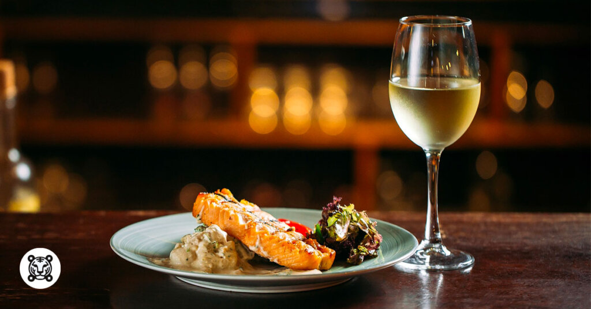

# TEAM
1. Denys Romaniuk, denysromaniuk07, Tasks: 1,2
2. Andriy Lazor, andriylazor7, Tasks: 5,6
3. Vladyslav Kuzil, vladysvk, Tasks: 3,4

# INTRODUCTION

Food is not only a requirement: it’s but one of our best sources of enjoyment. Mentioning like champagne, chocolate, also processors gives your mind a large “fun hit” that keeps us coming back for more. And planning is equally very important as the components: food using a browned crust usually tastes better than food with no as consumers of microwaves will attest.
In the last several decades, food science, and engineering are becoming more closely related than ever before. Scientifically minded chefs such as Harold McGee, Heston Blumenthal, also Ferran Adrià exploit science to develop occasionally un-American dishes.

Mouth to gut
The human digestive tract operates in phases. Some digestion occurs at the mouth area, but the procedure starts in earnest at the gut and is called the food moves during the intestines into the anus. Our bowels rely upon a booming cocktail of germs to assist them to digest your food.
Based on what they consume, other creatures arrange their digestive processes otherwise. Herbivores like cows possess the rumen — an excess chamber prior to the gut which will help break down the hard grass they consume — although alligators can divert excess blood for their stomachs to deal with their enormous meals.

Food in human development
Humans started as hunter-gatherers, growing agriculture along with domesticating creatures for farming. Sheep were likely the first creatures to be slaughtered, followed closely by cows along with hens.
We’re unsure exactly what our oldest ancestors ate, particularly, just how much of the daily diet was beef, though Ötzi that the iceman had swallowed Ibex, lettuce, lettuce, and grains (watch gallery). It’s been contended, controversially, the creation of ingesting proved to be an important component in human development (in addition to our jagged teeth) — a matter which partially hangs on when people discovered fire. Like people, apes additionally prefer cooked meals into raw — because cooked meals provide you more energy compared to uncooked ones.

# DATA

## Table description

This table showcases a variety of international dishes. From Italian pasta with red wine to Japanese sushi with sake, it illustrates the delightful connections between food and drink.

## Table    

| Cuisine   | Dish Type | Main Ingredient | Beverage Pairing | Serving Temperature |
|-----------|-----------|------------------|------------------|---------------------|
| Italian   | Pasta     | Tomato           | Red Wine         | Hot                 |
| Mexican   | Tacos     | Chicken          | Margarita        | Warm                |
| Japanese  | Sushi     | Salmon           | Sake             | Cold                |
| Indian    | Curry     | Lentils          | Chai             | Hot                 |
| French    | Baguette  | Flour            | Champagne        | Room Temperature     |
| Chinese   | Dumplings | Pork             | Green Tea        | Hot                 |

# IMAGES

